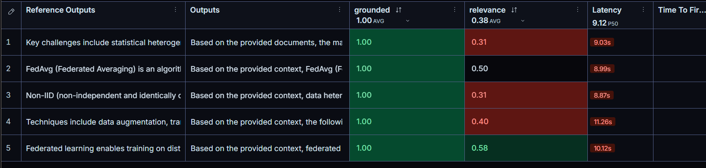

# PDF RAG

A RAG-powered PDF Q&A application. Upload any PDF and ask questions about it in natural language. Built with FastAPI, LangChain, ChromaDB, Google Gemini, and a Streamlit UI. Integrated with LangSmith for tracing and evaluation.

---

## Architecture

```
┌─────────────────┐        HTTP        ┌──────────────────────────────────────┐
│   Streamlit UI  │ ◄────────────────► │          FastAPI Backend             │
│  streamlit_app  │                    │                                      │
└─────────────────┘                    │  /api/upload  →  embed + store       │
                                       │  /api/chat    →  RAG chain           │
                                       │  /api/clear   →  reset               │
                                       └──────────┬───────────────────────────┘
                                                  │
                          ┌───────────────────────┼───────────────────────┐
                          │                       │                       │
                   ┌──────▼──────┐       ┌────────▼───────┐     ┌────────▼───────┐
                   │  ChromaDB   │       │  HuggingFace   │     │ Gemini 3.5     │
                   │ Vector Store│       │  MiniLM-L6-v2  │     │ Flash Lite     │
                   │ (local)     │       │  (embeddings)  │     │ (LLM)          │
                   └─────────────┘       └────────────────┘     └────────────────┘
                                                  │
                                         ┌────────▼───────┐
                                         │   LangSmith    │
                                         │ tracing + eval │
                                         └────────────────┘
```

**RAG Flow:**
1. PDF is loaded, split into chunks, embedded via HuggingFace, and stored in ChromaDB
2. On each question, MMR retrieval fetches the top 8 relevant chunks
3. Chunks + chat history are passed to Gemini via a customizable system prompt
4. Answer and source chunks are returned to the UI
5. Every request is traced in LangSmith (question → retrieval → LLM → answer)

---

## Project Structure

```
server/
├── main.py                        # FastAPI app, CORS, lifespan (startup/shutdown cleanup)
├── streamlit_app.py               # Streamlit frontend
├── evaluate.py                    # LangSmith evaluation script
├── pyproject.toml                 # Dependencies (uv)
├── .env                           # Environment variables (not committed)
│
├── app/
│   ├── models/
│   │   └── user.py                # Pydantic request/response models
│   ├── routes/
│   │   └── route.py               # API route handlers
│   └── services/
│       ├── chain.py               # RAG chain assembly + LangSmith run naming
│       ├── embedding.py           # Embeddings, ChromaDB client, vector store (singletons)
│       ├── llm.py                 # Gemini model init + dynamic prompt builder
│       ├── load_document.py       # PDF loading + text splitting
│       └── retriever.py           # MMR retriever from vector store
│
└── vector_store/                  # ChromaDB persisted data (auto-managed)
```

---

## Prerequisites

- [uv](https://docs.astral.sh/uv/getting-started/installation/) — Python package manager
- Python 3.13+
- Google AI Studio API key → [Get one here](https://aistudio.google.com/apikey)
- LangSmith API key → [Get one here](https://smith.langchain.com) (Settings → API Keys)

---

## Setup

**1. Clone and enter the server directory**

```bash
cd server
```

**2. Create a `.env` file**

```env
GOOGLE_API_KEY=your_google_api_key_here

# LangSmith tracing
LANGCHAIN_TRACING_V2=true
LANGCHAIN_API_KEY=your_langsmith_api_key_here
LANGCHAIN_PROJECT=AskThePDF
```

**3. Install dependencies**

```bash
uv sync
```

---

## Running the App

You need two terminals, both from the `server/` directory.

**Terminal 1 — FastAPI backend**

```bash
uv run uvicorn main:app --reload
```

Backend will be available at `http://localhost:8000`

**Terminal 2 — Streamlit UI**

```bash
uv run streamlit run streamlit_app.py
```

UI will open at `http://localhost:8501`

---

## API Reference

All routes are prefixed with `/api`.

### `POST /api/upload`

Upload a PDF and embed it into the vector store.

**Request:** `multipart/form-data`
| Field | Type | Description |
|-------|------|-------------|
| `file` | file | PDF file (required) |

**Response:**
```json
{
  "filename": "document.pdf",
  "message": "PDF uploaded and embedded successfully. You can now ask questions about it."
}
```

---

### `POST /api/chat`

Ask a question grounded in the uploaded PDF(s).

**Request body:**
```json
{
  "message": "What is unit 3 about?",
  "session_id": "optional-uuid-for-multi-turn",
  "system_prompt": "optional custom system prompt with {context} placeholder"
}
```

| Field | Type | Required | Description |
|-------|------|----------|-------------|
| `message` | string | yes | User question (1–2000 chars) |
| `session_id` | string | no | Reuse to maintain conversation history. Auto-generated if omitted |
| `system_prompt` | string | no | Override the default system prompt. Must contain `{context}` |

**Response:**
```json
{
  "answer": "Unit 3 covers optimization techniques...",
  "session_id": "abc-123",
  "sources": [
    {
      "content": "chunk text...",
      "page": 2,
      "source": "./uploads/document.pdf"
    }
  ]
}
```

---

### `DELETE /api/clear`

Wipe all embedded documents, uploaded files, and chat histories.

**Response:**
```json
{
  "message": "Vector store, uploads, and chat history cleared successfully."
}
```

---

### `GET /health` and `GET /api/health`

Health checks. `/health` also reports ChromaDB status.

---

## Streamlit UI Guide

| Feature | How to use |
|---------|-----------|
| Upload PDF | Sidebar → file uploader. Embedding happens automatically on upload |
| Ask questions | Type in the chat input at the bottom |
| View sources | Each answer has a collapsible "Sources" section showing retrieved chunks with page numbers |
| Custom system prompt | Sidebar → ⚙️ System Prompt → edit and click Apply |
| Reset prompt | Sidebar → ⚙️ System Prompt → Reset button |
| Clear everything | Sidebar → 🗑️ Clear & Reset (wipes vector store, uploads, and chat history) |

---

## LangSmith Tracing & Evaluation

Every chat request is automatically traced in LangSmith as an `AskThePDF-RAG` run, showing the full pipeline: question → retrieved chunks → prompt → Gemini → answer.

### Running the Evaluation

1. Start the FastAPI server
2. Upload your PDF via the Streamlit UI
3. Run the evaluation script:

```bash
uv run python evaluate.py
```

This creates a dataset in LangSmith, runs your Q&A pairs through the live RAG pipeline, and scores each answer on:
- **grounded** — did the model answer from the PDF or refuse?
- **relevance** — keyword overlap between the answer and the expected output

Results appear under Experiments at [smith.langchain.com](https://smith.langchain.com).



> Edit the `QA_PAIRS` list in `evaluate.py` to match your PDF's content before running.

---

## Configuration

### Changing the LLM

Edit `app/services/llm.py`:

```python
def get_model():
    return init_chat_model(
        model="gemini-3.5-flash-lite",  # change model here
        model_provider="google_genai",  # or "openai", "anthropic", etc.
        temperature=0.3,
    )
```

### Changing the Embedding Model

Edit `app/services/embedding.py`:

```python
EMBEDDING_MODEL = "sentence-transformers/all-MiniLM-L6-v2"  # swap to any HuggingFace model
```

> If you change the embedding model after documents are already stored, clear the vector store first — mixed embeddings will produce bad results.

### Tuning Retrieval

Edit `app/services/retriever.py`:

```python
return get_vector_store().as_retriever(
    search_type="mmr",                    # "mmr" for diversity, "similarity" for pure relevance
    search_kwargs={"k": 8, "fetch_k": 20} # k = chunks returned, fetch_k = candidates
)
```

### Chunk Size

Edit `app/services/load_document.py`:

```python
splitter = RecursiveCharacterTextSplitter(
    chunk_size=1000,   # characters per chunk
    chunk_overlap=200, # overlap between chunks
)
```

---

## Shutdown Behavior

When the FastAPI server shuts down (Ctrl+C), it automatically:
- Deletes the `uploads/` directory
- Resets the ChromaDB vector store

This keeps the environment clean between sessions. To persist embeddings across restarts, remove the cleanup logic from the `lifespan` handler in `main.py`.

---

## Environment Variables

| Variable | Required | Description |
|----------|----------|-------------|
| `GOOGLE_API_KEY` | yes | Google AI Studio API key for Gemini |
| `LANGCHAIN_TRACING_V2` | no | Set to `true` to enable LangSmith tracing |
| `LANGCHAIN_API_KEY` | no | LangSmith API key |
| `LANGCHAIN_PROJECT` | no | LangSmith project name (default: `AskThePDF`) |
| `HF_TOKEN` | no | HuggingFace token for higher rate limits on model downloads |
